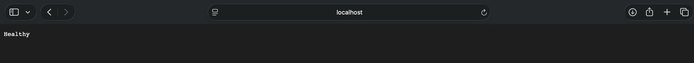
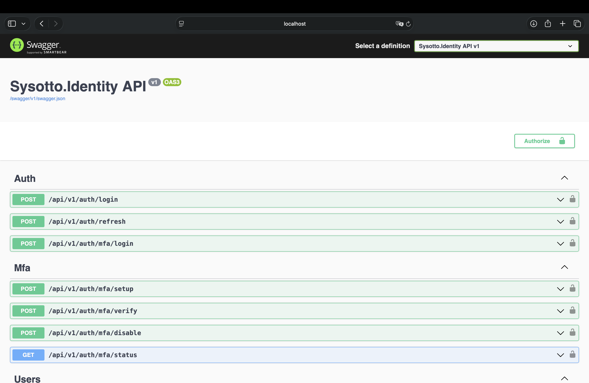
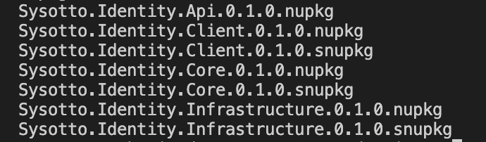
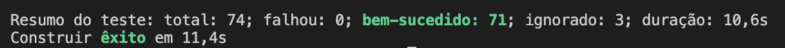

# 🎯 Sysotto.Identity - Showcase

[](https://dotnet.microsoft.com)  
[](https://docs.microsoft.com/en-us/dotnet/csharp/)  
[](https://www.postgresql.org/)  
[](#)  

> **Módulo moderno de gestão de identidade e autenticação para .NET 10**  
> 
> Sistema completo de **Identity Management** em produção, distribuído como pacote NuGet modular.
> Implementa padrões enterprise (Clean Architecture, CQRS, DDD), multi-tenancy com RLS, OAuth2/OIDC, MFA avançado e segurança em profundidade com conformidade LGPD.

## �️ Stack Tecnológico

**Framework & Linguagem:**
- `.NET 10.0` - Framework principal
- `C# 14` - Linguagem moderna com recursos avançados

**Banco de Dados:**
- `PostgreSQL 17` - Database relacional robusto
- `Entity Framework Core 10.0.0` - ORM para abstração de dados

**Autenticação & Autorização:**
- `ASP.NET Core Identity` - Gestão de usuários base
- `JWT (JSON Web Tokens)` - Autenticação stateless
- `OpenIddict 6.1.0` - OAuth2/OIDC server completo
- `Polly 8.6.5` - Resiliência (Retry, Circuit Breaker, Timeout)

**Cache & Performance:**
- `Redis 7.2` - Cache distribuído e session management
- `StackExchange.Redis 2.10.1` - Driver Redis

**Logging & Observabilidade:**
- `Serilog 4.3.0` - Structured logging
- `Serilog.AspNetCore 9.0.0` - Integração com ASP.NET Core
- `Health Checks` - Monitoramento de dependências

**Validação & Qualidade:**
- `FluentValidation 12.1.1` - Validação de dados fluente
- `xUnit` - Framework de testes unitários
- `Testcontainers` - Testes de integração com PostgreSQL

**API & Documentação:**
- `Swagger/OpenAPI` - Documentação interativa de APIs
- `API Versioning` - Controle de versão de endpoints

**MFA (Multi-Factor Authentication):**
- `TOTP (Time-based One-Time Password)` - Google Authenticator
- `Email OTP` - One-Time Passwords por email
- `QRCoder 1.4.3` - Geração de QR codes para TOTP

## 📸 Screenshots

### 1. Autenticação e Login


### 2. Gestão de Usuários


### 3. Controle de Acesso (RBAC)


### 4. Multi-Tenancy Dashboard


## 📁 Estrutura do Projeto

A arquitetura segue **Clean Architecture** com 4 módulos independentes, cada um com responsabilidades bem definidas:

```
Sysotto.Identity/
├── src/
│   ├── Sysotto.Identity.Core/
│   │   ├── CORE_README.md          ◄─ Documentação da camada Core
│   │   ├── Entities/    (User, Role, Tenant, Company, AuditLog)
│   │   ├── Enums/       (UserType, SubscriptionStatus, etc)
│   │   ├── Interfaces/  (IUserRepository, IAuthService, etc)
│   │   └── ValueObjects/ (Email, PasswordHash, PhoneNumber, Address)
│   │
│   ├── Sysotto.Identity.Infrastructure/
│   │   ├── INFRA_README.md        ◄─ Documentação da camada Infrastructure
│   │   ├── Data/        (IdentityDbContext, Migrations)
│   │   ├── Repositories/ (UserRepository, CompanyRepository, etc)
│   │   └── Services/    (AuthService, MfaService, RateLimitingService, etc)
│   │
│   ├── Sysotto.Identity.Api/
│   │   ├── API_README.md           ◄─ Documentação da camada Api
│   │   ├── Controllers/ (AuthController, MfaController, UsersController, etc)
│   │   ├── Dtos/        (LoginRequest, RegisterRequest, UserResponse, etc)
│   │   ├── Filters/     (ExceptionFilter, AuthorizationFilter)
│   │   └── Middleware/  (JwtValidation, TenantResolution, RateLimiting)
│   │
│   └── Sysotto.Identity.Client/
│       ├── CLIENT_README.md       ◄─ Documentação do SDK Client
│       ├── IdentityApiClient.cs
│       └── Dtos/
│
├── tests/
│   ├── Sysotto.Identity.UnitTests/
│   ├── Sysotto.Identity.IntegrationTests/ (com Testcontainers)
│   └── ...
│
├── docs/
│   └── ai/          (Arquitetura técnica detalhada)
│
├── .github/
│   └── workflows/
│       ├── ci-cd.yml       (Build + Testes)
│       └── publish.yml     (Publicar pacotes NuGet via tags)
│
├── nupkg/           (Armazena pacotes .nupkg e .snupkg)
├── setup-local-nuget.sh  (Script para feed NuGet local)
└── Sysotto.Identity.slnx
```

**Cada módulo é independente e pode ser usado isoladamente ou em conjunto com outros.**

## 🔑 Funcionalidades Principais

### Autenticação & Autorização
✅ JWT com rotação automática de tokens (Access: 30min, Refresh: 14 dias)  
✅ OAuth2/OIDC server completo via OpenIddict  
✅ Autenticação multi-fator: TOTP (Google Authenticator) + Email OTP  
✅ Detecção inteligente de brute-force com rate limiting adaptativo  

### Gestão de Usuários & Tenants
✅ Usuários Internos (Colaboradores) e Externos (Clientes)  
✅ Diferenciação PF/PJ com validação de documentos  
✅ Sistema de Planos Variáveis com Feature Flags  
✅ Multi-tenancy com isolamento via TenantId + PostgreSQL RLS  

### Segurança & Compliance
✅ Encriptação Argon2 para senhas (NIST-aprovado)  
✅ Row-Level Security no banco de dados  
✅ LGPD: consentimentos, portabilidade, direito ao esquecimento  
✅ Auditoria completa com IP logging e geolocalização  
✅ Security Headers (HSTS, CSP, X-Frame-Options, etc)  

### Observabilidade & DevOps
✅ Structured logging com Serilog (contexto correlado)  
✅ Health checks para dependências  
✅ CI/CD contínuo com GitHub Actions  
✅ Pacotes NuGet com symbols (.snupkg) para debugging  

## 🏗️ Arquitetura & Padrões de Design

**Clean Architecture** com responsabilidades bem separadas:

```
CLIENT APPLICATIONS
        ↓
    HTTP
        ↓
┌──────────────────────────────┐
│  API (Controllers, DTOs)     │ ← Endpoints e Middleware
└──────────────────────────────┘
        ↓ Depende de
┌──────────────────────────────┐
│ INFRASTRUCTURE (EF, Services)│ ← Persistência e Auth
└──────────────────────────────┘
        ↓ Depende de
┌──────────────────────────────┐
│  CORE (Entities, VOs, Rules) │ ← Lógica de negócio pura
└──────────────────────────────┘
```

**Padrões Implementados:**
- 🎯 **SOLID Principles** - Responsabilidade única, bem definida
- 🛡️ **Domain-Driven Design** - Modelo enriquecido com regras
- 🔄 **Repository Pattern** - Abstração de acesso a dados
- 📊 **CQRS** - Separação de leitura/escrita
- ⚡ **Result Pattern** - Erros como valores, não exceções
- 🔗 **Dependency Injection** - Inversão de controle nativa

## 🧪 Qualidade & Testes

- ✅ **71+ Testes** Unit + Integration passando
- ✅ **PostgreSQL via Testcontainers** - Testes isolados e reproduzíveis
- ✅ **FluentValidation** - Validação de dados em múltiplas camadas
- ✅ **Architecture Tests** - Garantia de Clean Architecture
- ✅ **Code Analysis** - StyleCop e análise estática

## 📦 Distribuição como NuGet

```bash
# Core (Entidades, interfaces, value objects)
dotnet add package Sysotto.Identity.Core

# Infrastructure (EF Core, repos, services)
dotnet add package Sysotto.Identity.Infrastructure

# API (Controllers, middleware, DTOs)
dotnet add package Sysotto.Identity.Api

# Client (SDK para consumo da API)
dotnet add package Sysotto.Identity.Client
```

## 💡 Por Que Este Projeto Impressiona

Este projeto demonstra competências fundamentais para desenvolvimento enterprise:

1. **Arquitetura Escalável** - Clean Architecture que cresce sem refatorações maiores
2. **Segurança em Profundidade** - Não apenas hashing, mas detecção de anomalias, rate limiting, RLS
3. **Modularidade Real** - 4 pacotes NuGet independentes, cada um usável isoladamente
4. **Qualidade Comprovada** - 71+ testes, padrões SOLID, validação em múltiplas camadas
5. **DevOps Maturo** - CI/CD automatizado, symbol packages, migrations versionadas
6. **Compliance Legal** - LGPD completo (não é checkbox, está implementado e documentado)
7. **Multi-tenancy Real** - Com PostgreSQL RLS, não apenas filtros em código
8. **Production-Ready** - Logging estruturado, health checks, circuit breakers, resiliência

## 👨‍💻 Sobre o Desenvolvedor

**Otto Freitag**  
Desenvolvedor Full-Stack .NET com especialização em:
- Arquitetura de software e padrões de design
- Sistemas distribuídos e escalabilidade horizontal
- Segurança de aplicações e conformidade regulatória
- DevOps e automação de processos

[](https://github.com/OttoF77)

---

**Projeto Privado** - Todos os direitos reservados © 2025-2026